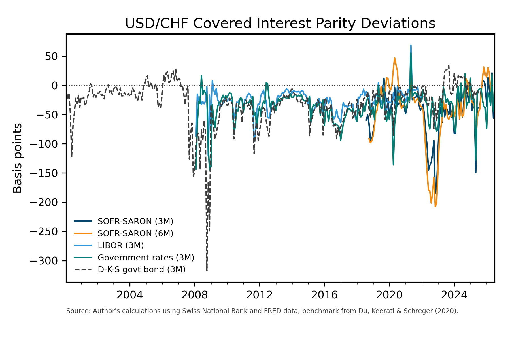

# Monthly USD/CHF Covered Interest Parity Deviations


This repository provides monthly estimates of covered interest parity (CIP) deviations for the USD/CHF pair. The measures are constructed from USD/CHF spot and forward exchange rates together with short-term USD and CHF interest-rate benchmarks. The chart compares the estimated series with the CHF government-bond CIP benchmark of Du, Keerati, and Schreger.

---

### Chart



---

### Data

The generated dataset is available here:

* **Monthly USD/CHF CIP deviations:** [`data/usd_chf_cip_deviations_monthly.csv`](data/usd_chf_cip_deviations_monthly.csv)

The CSV contains only the estimated deviation series:

* `cip_basis_sofr_saron_3m_bps`
* `cip_basis_sofr_saron_6m_bps`
* `cip_basis_libor_3m_bps`
* `cip_basis_government_3m_bps`

---

### Methodology

For tenor \(T\), the forward-implied USD-CHF interest-rate differential is:

```text
- log(F_t^T / S_t) / T
```

where \(S_t\) is the spot exchange rate in CHF per USD and \(F_t^T\) is the corresponding forward rate. The CIP deviation is:

```text
(r_USD,t^T - r_CHF,t^T) - [-log(F_t^T / S_t) / T]
```

The series are annualized and reported in basis points.

---

### Sources

* Swiss National Bank: USD/CHF spot and forward rates; CHF SARON compound rates; CHF money-market and legacy LIBOR rates.
* FRED: SOFR index and 3-month US Treasury constant-maturity yield.
* Du, Keerati, and Schreger: CHF government-bond CIP benchmark used in the chart.

---

### Replication

Run:

```bash
pip install -r requirements.txt
python usd_chf_cip.py
```

The GitHub Action refreshes the data and chart monthly.
